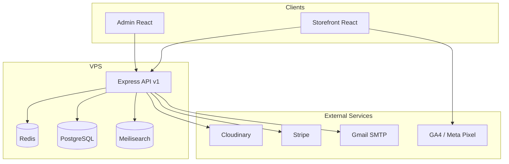
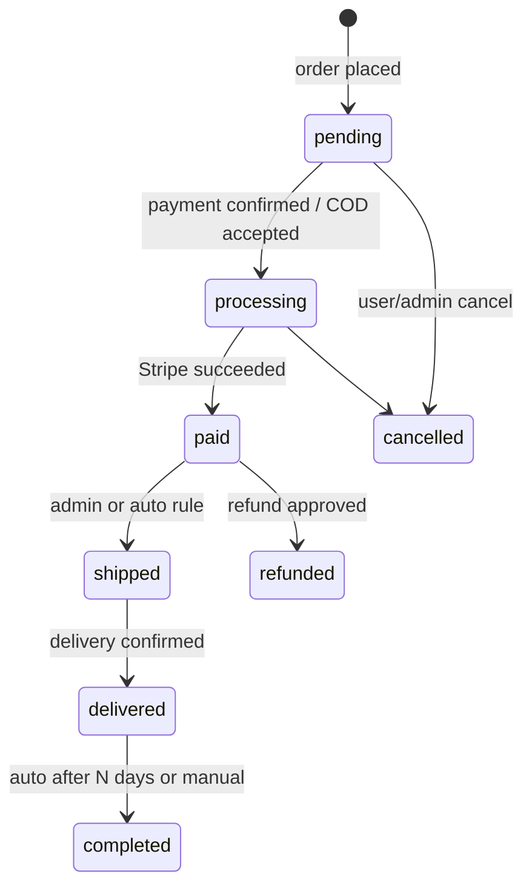

# Architecture — Abu Al-Nas E-Commerce Platform

## 1. System Context



| Application | URL (production) | Purpose |
|-------------|------------------|---------|
| Storefront | `https://www.{domain}` | Public shop, AR/EN |
| Admin | `https://admin.{domain}` | Operations, CMS, RBAC |
| API | `https://api.{domain}` | REST `/api/v1` |

---

## 2. Clean Architecture (API)

```
apps/api/src/
├── config/           # env, db, redis, meili, stripe
├── domain/           # entities, business rules (pure TS)
├── application/      # use cases / services
├── infrastructure/   # prisma, repositories, email, cloudinary, stripe
├── presentation/     # routes, controllers, middleware, validators
└── shared/           # errors, types, constants
```

**Dependency rule:** `presentation → application → domain`; `infrastructure` implements interfaces defined in `application`.

---

## 3. Cross-Cutting Concerns

### Authentication
- Register / login / logout / refresh
- Email verification + password reset
- Access JWT (15m) + refresh token (7d, stored hashed in DB, rotated)
- Checkout gate: middleware returns `401` with `{ requireAuth: true }` for checkout endpoints

### Authorization
- Permission strings: `products:write`, `orders:read`, etc.
- Middleware `requirePermission('orders:write')`
- Role seed on migration; Super Admin bypass

### i18n
- DB: `title_ar`, `title_en` (or JSONB `translations`) on products, categories, CMS
- API: `Accept-Language: ar|en` or `?lang=ar`
- Storefront: `react-i18next`, default `ar`, RTL via `dir` on `<html>`

### Search pipeline
1. Product saved in PostgreSQL
2. Event/job pushes document to Meilisearch index `products`
3. Fields: id, sku, titles, descriptions, tags, category path, price, stock, rating, image, locale payloads
4. Storefront: `/search` debounced + `/search/suggest` for predictive

### Caching (Redis)
- Guest cart: `cart:guest:{uuid}`
- Rate limit buckets
- Session optional data
- Hot settings: `settings:public`

### File uploads
- Multer memory/disk → validate mime/size → Cloudinary upload → store `public_id`, `url` in DB

---

## 4. Storefront Architecture

- **React 18 + TypeScript + Vite**
- **Tailwind CSS 3** + CSS variables for theme/dark
- **Framer Motion** for hero, cards, page transitions
- **React Router 6** with locale in path optional: `/ar/store`, `/en/store`
- **TanStack Query** for API state
- **Zustand** for UI (compare list, mini-cart open)
- **react-helmet-async** for SEO meta + JSON-LD components

### Key pages (v1 scope)
Home, About, Categories, Contact (+ FAQ section), Packages, Store (filters/sort), Product Detail, Login/Register, Profile, Cart, Checkout (multi-step), Order Success, Blog (footer), static legal pages from CMS.

### Guest → auth flow
1. Guest gets `cartToken` cookie
2. Cart stored in Redis linked to token
3. At checkout step 1 → modal login/register
4. On success: merge Redis cart into `carts` table, clear guest token

---

## 5. Admin Architecture

- Separate **Vite + React + TypeScript** project
- Same design tokens / shared package for colors
- **Role-based route guards** mirroring API permissions
- Modules: Dashboard, Products, Categories, Packages, Inventory, Orders, Customers, Promotions, CMS, Blog, Users/Roles, Refunds, Settings, Audit Logs, Bulk Tools, Analytics (Insights)

---

## 6. Order State Machine (Auto Transitions)



Configurable auto rules stored in `order_automation_rules` (e.g. COD: `pending → processing` immediately).

---

## 7. Payment Abstraction

```typescript
interface PaymentProvider {
  id: string;
  createIntent(order: Order): Promise<PaymentIntent>;
  handleWebhook(payload: unknown): Promise<void>;
  refund(paymentId: string, amount: number): Promise<RefundResult>;
}
```

Implementations: `cod`, `stripe`. Future: `myfatoorah`, etc.

---

## 8. Shipping Module

- **Zones:** Jordan governorates or custom regions (admin CRUD)
- **Rates:** Per zone flat amount
- **Free shipping:** `subtotal >= settings.free_shipping_threshold` → rate 0
- No external carrier APIs; optional tracking number field on shipment

---

## 9. Promotion Engine

- **Coupons:** code, type (% / fixed / free_shipping), rules JSON (min order, categories, usage limits, per-user limit, expiry)
- **Campaigns:** flash / scheduled; links products or categories with sale price or % off
- **Stacking:** disabled — validate single active coupon
- Application order: campaign prices on line items → then coupon on eligible subtotal

---

## 10. Loyalty & Referral (v1)

**Loyalty**
- Account per user; earn points on `completed` orders (configurable rate)
- Redeem at checkout (max % of order configurable)
- Ledger: `loyalty_transactions`

**Referral**
- Unique code per user; referee gets benefit on first order; referrer gets credit/points
- Track `referrals` table; anti-fraud: same device/email rules (basic)

---

## 11. Refund Workflow

1. Customer submits refund request (order id, reason, up to N images)
2. Status: `requested` → `under_review` → `approved` | `rejected`
3. Sales/Admin reviews evidence in admin UI
4. On approve: order → `refunded`, inventory restocked optional flag, manual Stripe void if applicable

---

## 12. Observability & Audit

- **Audit logs:** actor, action, entity, diff JSON, IP, timestamp
- **Export:** CSV from admin
- **Health:** `/api/v1/health` (db, redis, meili)

---

## 13. Docker (Local / VPS)

```yaml
services:
  postgres:
  redis:
  meilisearch:
  api:        # depends on above
  # storefront/admin: dev servers or nginx static
```

Production: Nginx reverse proxy, Certbot, PM2 or Docker for API, static builds for SPAs.

---

## 14. Environments

| Env | Purpose |
|-----|---------|
| development | Local Docker + hot reload |
| staging | VPS mirror, Stripe test |
| production | Live domain, Stripe live when ready |

Env files: `.env.development`, `.env.staging`, `.env.production` (never committed).

---

## 15. API Versioning & Documentation

- All routes under `/api/v1`
- OpenAPI 3.1 generated from route schemas or `swagger-jsdoc`
- Postman collection exported in `/docs/postman/`
- Curl examples in `API_DOCUMENTATION.md`

---

## 16. Testing Strategy

| Layer | Tool |
|-------|------|
| Unit | Vitest (API services, utils) |
| Integration | Supertest + test DB |
| E2E API | Critical flows: auth, checkout COD |
| Component | React Testing Library (storefront/admin) |

---

## 17. Performance

- Image: Cloudinary transforms (`f_auto,q_auto,w_*`)
- Lazy routes + lazy images
- API pagination cursor-based for catalog
- DB indexes on `sku`, `category_id`, `order.user_id`, `created_at`
- Meilisearch for catalog search/filter; PG for transactional queries only
